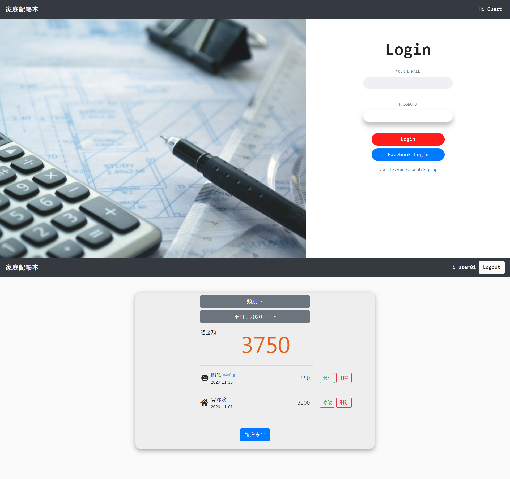

# Expense Tracker

My dad's mad money.  m(@^___^@)m



### Users could...

- Add expense record.
- Delete expense record.
- Edit expense record.
- Filter records by categories & date.
- Watch total amount.

### Getting Started

- Clone repository to your local project

```bash
git clone git@github.com:ccyang02/expense_tracker.git
```

- Install dependencies

```bash
cd expense_tracker
npm install
```


### Built with

- Node.js: 10.16.0
- express: 4.17.1
- express-handlebars: 5.1.0
- express-session: 1.17.1
- method-override: 3.0.0
- mongoDB: 2.1.0
- mongoose: 5.10.9